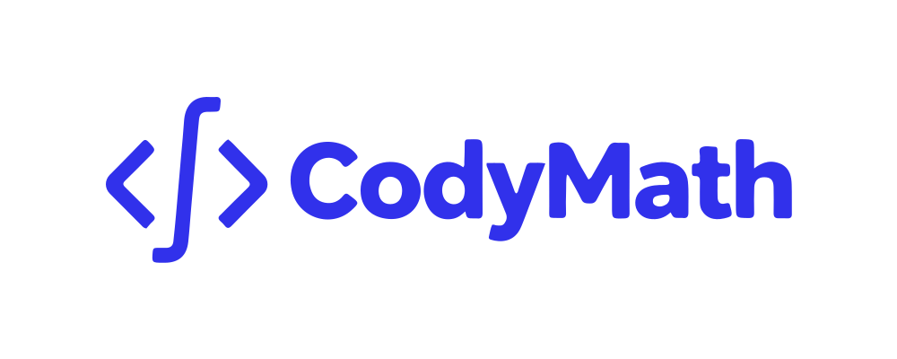

<p align="center">
  
</p>
<div style="display: flex; align-items: center; gap: 20px;">
  <a href="https://www.npmjs.com/package/codymath" target="_blank">
    
  </a>
  | <strong> Current Status: Early Development (v0.4.0)</strong>
</div>
CodyMath is on a mission to become the most complete open-source mathematics library for JavaScript and TypeScript. By implementing thousands of rigorously tested formulas from authoritative sources, we provide a universal toolbox for developers, students, and researchers worldwide.


---
## ❤️ Support the Project

**CodyMath** is an ambitious open-source project, built and maintained with dedication during free time. Our goal is to create the largest and most complete mathematics library for the global JavaScript and TypeScript community.

If you find this library useful and it helps you in your projects, please consider making a contribution. Every donation helps us dedicate more time to adding new features, improving documentation, and ensuring the project stays healthy and active for years to come.

Thank you for your support!

| Method | Address / Link |
| :--- | :--- |
|  | [`Click here to donate via PayPal`](https://www.paypal.com/donate/?hosted_button_id=8XYHYQNR2E27J) |
|  | `bc1q3zu0nng6765ptpmr86jcfn68h6e62sda7382e3` |
|  | `0xF7Eb1D45cDD527b11BC49416DDfA51AD38e26ca1` |
## Usage

### Installation
```bash
npm install codymath
```
### Or use CDN
```javascript
<script src="https://cdn.jsdelivr.net/npm/codymath@latest/dist/codymath.umd.js"></script>
```
### HTML Usage Example
```javascript
<!DOCTYPE html>
<html lang="en">
<head>
  <meta charset="UTF-8">
  <title>CodyMath CDN Test</title>
  <script src="https://cdn.jsdelivr.net/npm/codymath@latest/dist/codymath.umd.js"></script>
</head>
<body>
  <h1>CodyMath Test</h1>
  <div id="output"></div>

  <script>
    // 2. You can now use the global 'CodyMath' object
    const { greekAlphabet } = CodyMath;
    const omega = greekAlphabet.omega;

    // Example of how to display it on the page
    document.getElementById('output').innerText = `The Greek letter is ${omega.name} (${omega.upper}, ${omega.lower})`;
  </script>
</body>
</html>
```
---
## Current Features
### Module: `alphabets/greek`
* **Alphabets:** Provides the full 24 letters of the Greek alphabet for use in formulas and notation. Below is a complete list of the available letters.
    | Letter | Lowercase | Uppercase | Library Key |
    | :--- | :---: | :---: | :--- |
    | Alpha | α | Α | `alpha` |
    | Beta | β | Β | `beta` |
    | Gamma | γ | Γ | `gamma` |
    | Delta | δ | Δ | `delta` |
    | Epsilon | ε | Ε | `epsilon` |
    | Zeta | ζ | Ζ | `zeta` |
    | Eta | η | Η | `eta` |
    | Theta | θ | Θ | `theta` |
    | Iota | ι | Ι | `iota` |
    | Kappa | κ | Κ | `kappa` |
    | Lambda | λ | Λ | `lambda` |
    | Mu | μ | Μ | `mu` |
    | Nu | ν | Ν | `nu` |
    | Xi | ξ | Ξ | `xi` |
    | Omicron | ο | Ο | `omicron` |
    | Pi | π | Π | `pi` |
    | Rho | ρ | Ρ | `rho` |
    | Sigma | σ | Σ | `sigma` |
    | Tau | τ | Τ | `tau` |
    | Upsilon | υ | Υ | `upsilon` |
    | Phi | φ | Φ | `phi` |
    | Chi | χ | Χ | `chi` |
    | Psi | ψ | Ψ | `psi` |
    | Omega | ω | Ω | `omega` |
```javascript
//#### Usage Example
// Import the module
import { greekAlphabet } from 'codymath';

// Access the properties of a specific letter.
// IMPORTANT: You MUST specify a property (.lower or .upper) to get the character.
// Calling the letter name directly (e.g., greekAlphabet.pi) will return an object, not the symbol.
console.log('The symbol for Pi is:', greekAlphabet.pi.upper);
// Output: The symbol for Pi is: Π
//OR
// Access the properties of a specific letter
console.log('The symbol for Pi is:', greekAlphabet.pi.lower);
// Output: The symbol for Pi is: π

// Use different properties in a sentence
const sigma = greekAlphabet.sigma;
console.log(`The letter ${sigma.name} is often used for summations (${sigma.upper}) and standard deviation (${sigma.lower}).`);
// Output: The letter Sigma is often used for summations (Σ) and standard deviation (σ).
```

<details>
<summary><strong>🧪Click here to see the test result via CDN 🌐</strong></summary>

```html
<!DOCTYPE html>
<html lang="en">
<head>
    <meta charset="UTF-8">
    <title>CodyMath CDN Test</title>
    <script src="https://cdn.jsdelivr.net/npm/codymath@latest/dist/codymath.umd.js"></script>
    <link rel="stylesheet" href="./index.css">
</head>
<body>
    <main>
        <h1>CodyMath CDN Test</h1>
        <div id="output1"></div>
        <div id="output2"></div>
        <div id="output3"></div>
        <div id="output4"></div>
        <div id="output5"></div>
        <div id="output6"></div>
        <div id="output7"></div>
        <div id="output8"></div>
        <div id="output9"></div>
        <div id="output10"></div>
        <div id="output11"></div>
        <div id="output12"></div>
        <div id="output13"></div>
        <div id="output14"></div>
        <div id="output15"></div>
        <div id="output16"></div>
        <div id="output17"></div>
        <div id="output18"></div>
        <div id="output19"></div>
        <div id="output20"></div>
        <div id="output21"></div>
        <div id="output22"></div>
        <div id="output23"></div>
        <div id="output24"></div>
        <div id="output25"></div>
    </main>
    <script src="./index.js"></script>
</body>
</html>
```
--- 
```js
 // 2. You can now use the global 'CodyMath' object
const { greekAlphabet } = CodyMath;
    
    const alpha = greekAlphabet.alpha;
    const beta = greekAlphabet.beta;
    const gamma = greekAlphabet.gamma;
    const delta = greekAlphabet.delta;
    const epsilon = greekAlphabet.epsilon;
    const zeta = greekAlphabet.zeta;
    const eta = greekAlphabet.eta;
    const theta = greekAlphabet.theta;
    const iota = greekAlphabet.iota;
    const kappa = greekAlphabet.kappa;
    const lambda = greekAlphabet.lambda;
    const mu = greekAlphabet.mu;
    const nu = greekAlphabet.nu;
    const xi = greekAlphabet.xi;
    const omicron = greekAlphabet.omicron;
    const pi = greekAlphabet.pi;
    const rho = greekAlphabet.rho;
    const sigma = greekAlphabet.sigma;
    const tau = greekAlphabet.tau;
    const upsilon = greekAlphabet.upsilon;
    const phi = greekAlphabet.phi;
    const chi = greekAlphabet.chi;
    const psi = greekAlphabet.psi;
    const omega = greekAlphabet.omega;
  

    // Example of how to display it on the page
    document.getElementById('output1').innerText = `The Greek letter is ${alpha.name} (${alpha.upper}, ${alpha.lower})`;
    document.getElementById('output2').innerText = `The Greek letter is ${beta.name} (${beta.upper}, ${beta.lower})`;
    document.getElementById('output3').innerText = `The Greek letter is ${gamma.name} (${gamma.upper}, ${gamma.lower})`;
    document.getElementById('output4').innerText = `The Greek letter is ${delta.name} (${delta.upper}, ${delta.lower})`;
    document.getElementById('output5').innerText = `The Greek letter is ${epsilon.name} (${epsilon.upper}, ${epsilon.lower})`;
    document.getElementById('output6').innerText = `The Greek letter is ${zeta.name} (${zeta.upper}, ${zeta.lower})`;
    document.getElementById('output7').innerText = `The Greek letter is ${eta.name} (${eta.upper}, ${eta.lower})`;
    document.getElementById('output8').innerText = `The Greek letter is ${theta.name} (${theta.upper}, ${theta.lower})`;
    document.getElementById('output9').innerText = `The Greek letter is ${iota.name} (${iota.upper}, ${iota.lower})`;
    document.getElementById('output10').innerText = `The Greek letter is ${kappa.name} (${kappa.upper}, ${kappa.lower})`;
    document.getElementById('output11').innerText = `The Greek letter is ${lambda.name} (${lambda.upper}, ${lambda.lower})`;
    document.getElementById('output12').innerText = `The Greek letter is ${mu.name} (${mu.upper}, ${mu.lower})`;
    document.getElementById('output13').innerText = `The Greek letter is ${nu.name} (${nu.upper}, ${nu.lower})`;
    document.getElementById('output14').innerText = `The Greek letter is ${xi.name} (${xi.upper}, ${xi.lower})`;
    document.getElementById('output15').innerText = `The Greek letter is ${omicron.name} (${omicron.upper}, ${omicron.lower})`;
    document.getElementById('output16').innerText = `The Greek letter is ${pi.name} (${pi.upper}, ${pi.lower})`;
    document.getElementById('output17').innerText = `The Greek letter is ${rho.name} (${rho.upper}, ${rho.lower})`;
    document.getElementById('output18').innerText = `The Greek letter is ${sigma.name} (${sigma.upper}, ${sigma.lower})`;
    document.getElementById('output19').innerText = `The Greek letter is ${tau.name} (${tau.upper}, ${tau.lower})`;
    document.getElementById('output20').innerText = `The Greek letter is ${upsilon.name} (${upsilon.upper}, ${upsilon.lower})`;
    document.getElementById('output21').innerText = `The Greek letter is ${phi.name} (${phi.upper}, ${phi.lower})`;
    document.getElementById('output22').innerText = `The Greek letter is ${chi.name} (${chi.upper}, ${chi.lower})`;
    document.getElementById('output23').innerText = `The Greek letter is ${psi.name} (${psi.upper}, ${psi.lower})`;
    document.getElementById('output24').innerText = `The Greek letter is ${omega.name} (${omega.upper}, ${omega.lower})`;
```
--- 
![cdnTest][cdnTest]

[cdnTest]: ./assets/img/testsImgs/greek/cdnTestCodyMathLib.svg

</details>

<details>
<summary><strong>🧪Click here to see the test result locally via NPM package 📦</strong></summary>

```html
<!DOCTYPE html>
<html lang="en">
<head>
    <meta charset="UTF-8">
    <meta name="viewport" content="width=device-width, initial-scale=1.0">
    <title>CodyMath Local NPM Package Test</title>
    <script src="https://cdn.tailwindcss.com"></script>
    <link href="https://fonts.googleapis.com/css2?family=Inter:wght@400;500;700&display=swap" rel="stylesheet">
    <style>
        body { font-family: 'Inter', sans-serif; }
        .logo-container { display: flex; justify-content: center; align-items: center; gap: 1rem; }
    </style>
</head>
<body class="bg-gray-900 text-white flex items-center justify-center min-h-screen p-4">

    <div class="w-full max-w-2xl bg-gray-800 rounded-lg shadow-xl p-8 border border-gray-700">
        <div class="logo-container mb-6">
            
        </div>
        <h1 class="text-2xl font-bold text-center mb-2">Local NPM Package Test</h1>
        <p class="text-center text-gray-400 mb-6">Testing `codymath` imported from `node_modules`.</p>

        <div class="bg-gray-900 rounded-md p-4 border border-gray-600">
            <h2 class="font-semibold text-lg mb-2 text-green-400">Test Results:</h2>
            <pre class="text-sm text-gray-300 whitespace-pre-wrap"><code id="output">Loading and testing library...</code></pre>
        </div> 

        <div class="mt-6 bg-gray-900 rounded-md p-4 border border-gray-600">
            <h2 class="font-semibold text-lg mb-4 text-green-400">Greek Alphabet:</h2>
            <div id="greek-alphabet-display" class="flex flex-wrap gap-x-4 gap-y-2 text-lg text-center">
            </div>
        </div>
    </div>

<script type="module" src="main.js"></script>
</body>
</html>

```
--- 
```js
import { greekAlphabet } from 'codymath';

const outputElement = document.getElementById('output');
let results = [];

try {
    if (greekAlphabet && typeof greekAlphabet === 'object') {
        results.push('✅ SUCCESS: Module `greekAlphabet` loaded.');
    } else {
        throw new Error('Module `greekAlphabet` is not an object.');
    }

    const letterCount = Object.keys(greekAlphabet).length;
    if (letterCount === 24) {
         results.push(`✅ SUCCESS: All 24 letters found.`);
    } else {
         throw new Error(`FAILURE: Expected 24 letters, found ${letterCount}.`);
    }

    const pi = greekAlphabet.pi;
    if (pi && pi.name === 'Pi' && pi.lower === 'π') {
         results.push('✅ SUCCESS: Object `pi` is correct.');
    } else {
         results.push('❌ FAILURE: Object `pi` is incorrect!');
    }

    const omega = greekAlphabet.omega;
    results.push('');
    results.push('--- Usage Example ---');
    results.push(`Using Omega: ${omega.name} -> ${omega.upper} ${omega.lower}`);

    outputElement.textContent = results.join('\n');
    outputElement.style.color = '#6EE7B7';

    const alphabetContainer = document.getElementById('greek-alphabet-display');
    if(alphabetContainer) {
        const alphabetHTML = Object.values(greekAlphabet).map(letter => {
            return `<span class="w-20 flex items-center justify-center p-2 bg-gray-700 rounded-md" title="${letter.name}">${letter.upper} ${letter.lower}</span>`;
        }).join('');

        alphabetContainer.innerHTML = alphabetHTML;
    }

} catch (error) {
    results.push(`❌ CRITICAL ERROR: Could not run the tests.`);
    results.push(error.message);
    outputElement.textContent = results.join('\n');
    outputElement.style.color = '#F87171';
}

```
--- 
![cdnTest][packageTest]

[packageTest]: ./assets/img/testsImgs/greek/localNpmTestCodyMathLib.svg

</details>

---
### Module: `constants/constants`
* **Mathematical Constants:** A collection of high-precision fundamental constants. Below is a list of the currently available values.

    | Constant Name | Symbol | Description | Library Key |
    | :--- | :---: | :--- | :--- |
    | Pi | $\pi$ | The ratio of a circle's circumference to its diameter. | `pi` |
    | Euler's Number | $e$ | The base of the natural logarithm. | `e` |
    | Euler-Mascheroni | $\gamma$ | The limiting difference between the harmonic series and `ln(n)`. | `eulerMascheroni` |
    | e to the Gamma | $e^\gamma$ | One of the Mertens' constants from number theory. | `eToTheGamma` |
    | Square Root of e | $\sqrt{e}$ | The square root of Euler's number. | `sqrtE` |
    | Square Root of Pi | $\sqrt{\pi}$ | The square root of Pi, also equal to Γ(1/2). | `sqrtPi` |
    | Radians to Degrees | `rad → deg` | The conversion factor from radians to degrees (180/π). | `radToDeg` |
    | Degrees to Radians | `deg → rad` | The conversion factor from degrees to radians (π/180). | `degToRad` |
    | Gamma of 1/3 | $\Gamma(\frac{1}{3})$ | The value of the Gamma function at 1/3. | `gammaOneThird` |
    | Gamma of 1/4 | $\Gamma(\frac{1}{4})$ | The value of the Gamma function at 1/4. | `gammaOneFourth` |

```javascript
// #### Usage Example (constants)
// Import the constants object
import { constants } from 'codymath';

// 1. Pi (π)
console.log(`π = ${constants.pi}`);
// Output: π = 3.141592653589793

// 2. Euler's Number (e)
console.log(`e = ${constants.e}`);
// Output: e = 2.718281828459045

// 3. Euler–Mascheroni Constant (γ)
console.log(`γ = ${constants.eulerMascheroni}`);
// Output: γ = 0.5772156649015329

// 4. e to the Gamma (e^γ)
console.log(`e^γ = ${constants.eToTheGamma}`);
// Output: e^γ = 1.7810724179901979

// 5. Square Root of e (√e)
console.log(`√e = ${constants.sqrtE}`);
// Output: √e = 1.6487212707001282

// 6. Square Root of Pi (√π)
console.log(`√π = ${constants.sqrtPi}`);
// Output: √π = 1.7724538509055159

// 7. Radians → Degrees
const radians = 1;
console.log(`${radians} rad = ${constants.radToDeg * radians}°`);
// Output: 1 rad = 57.29577951308232°

// 8. Degrees → Radians
const degrees = 180;
const rad = constants.degToRad * degrees;
console.log(`${degrees}° = ${rad} rad`);
// Output: 180° = 3.141592653589793 rad

console.log(`Equal to π? ${rad === constants.pi}`);
// Output: Equal to π? true

// 9. Gamma(1/3)
console.log(`Γ(1/3) = ${constants.gammaOneThird}`);
// Output: Γ(1/3) = 2.678938534707747

// 10. Gamma(1/4)
console.log(`Γ(1/4) = ${constants.gammaOneFourth}`);
// Output: Γ(1/4) = 3.6256099082219083

```
--- 

<details>
<summary><strong>🧪Click here to see the test result </strong></summary>

```js
function initializeTests() {
  const { constants } = CodyMath;
  const { greekAlphabet } = CodyMath;
  const resultsContainer = document.getElementById("test-results-container");
  const usageCodeBlock = document.getElementById("usage-code-block");

  const referenceValues = {
    pi: constants.pi,
    e: constants.e,
    eulerMascheroni: constants.eulerMascheroni,
    eToTheGamma: constants.eToTheGamma,
    sqrtE: constants.sqrtE,
    sqrtPi: constants.sqrtPi,
    radToDeg: constants.radToDeg,
    degToRad: constants.degToRad,
    gammaOneThird: constants.gammaOneThird,
    gammaOneFourth: constants.gammaOneFourth,
  };

  const constantsToTest = [
    { symbol: "π", key: "pi" },
    { symbol: "e", key: "e" },
    { symbol: "γ", key: "eulerMascheroni" },
    { symbol: "e^γ", key: "eToTheGamma" },
    { symbol: "√e", key: "sqrtE" },
    { symbol: "√π", key: "sqrtPi" },
    { symbol: "rad → deg", key: "radToDeg" },
    { symbol: "deg → rad", key: "degToRad" },
    { symbol: "Γ(1/3)", key: "gammaOneThird" },
    { symbol: "Γ(1/4)", key: "gammaOneFourth" },
  ];

  function runTests() {
    if (!resultsContainer) return;
    resultsContainer.innerHTML = "";

    constantsToTest.forEach((item, index) => {
      const libValue = constants[item.key];
      const refValue = referenceValues[item.key];
      const isApproved = libValue === refValue;

      const row = document.createElement("div");
      row.className = "test-result-row";
      row.style.animationDelay = `${index * 100}ms`;

      const symbolEl = document.createElement("span");
      symbolEl.className = "symbol";
      symbolEl.textContent = item.symbol;

      const progressContainer = document.createElement("div");
      progressContainer.className = "progress-bar-container";

      const progressBar = document.createElement("div");
      progressBar.className = `progress-bar ${
        isApproved ? "approved" : "rejected"
      }`;

      const statusIcon = document.createElement("span");
      statusIcon.className = `status-icon ${
        isApproved ? "approved" : "rejected"
      }`;
      statusIcon.textContent = isApproved ? "✔" : "❌";

      progressContainer.appendChild(progressBar);
      row.appendChild(symbolEl);
      row.appendChild(progressContainer);
      row.appendChild(statusIcon);
      resultsContainer.appendChild(row);

      setTimeout(() => {
        progressBar.style.width = "100%";
      }, 100 + index * 100);
    });
  }

  function populateUsageExamples() {
    if (!usageCodeBlock) return;

    function runExample(codeSnippet, fn) {
      let result;
      try {
        result = fn();
      } catch (err) {
        result = `Error: ${err.message}`;
      }
      return `${codeSnippet}\n// Expected Output ➜ ${result}\n`;
    }

    const codeExamples = [
      runExample(
        `1. Pi (${greekAlphabet.pi.lower})\nconsole.log(\`\${greekAlphabet.pi.lower} = \${constants.pi}\`);`,
        () => ` π = 3.141592653589793 // \n\n RESULT =  ${greekAlphabet.pi.lower} = ${constants.pi} `
      ),
      runExample(
        `2. Euler's Number (e)\nconsole.log(\`e = \${constants.e}\`);`,
        () => ` e = 2.718281828459045 // \n\n RESULT =  e = ${constants.e} `
      ),
      runExample(
        `3. Euler–Mascheroni Constant (γ)\nconsole.log(\`γ = \${constants.eulerMascheroni}\`);`,
        () => ` γ = ${constants.eulerMascheroni} // \n\n RESULT =  γ = ${constants.eulerMascheroni} `
      ),
      runExample(
        `4. e to the Gamma (e^γ)\nconsole.log(\`e^γ = \${constants.eToTheGamma}\`);`,
        () => ` e^γ = ${constants.eToTheGamma} // \n\n RESULT =  e^γ = ${constants.eToTheGamma} `
      ),
      runExample(
        `5. Square Root of e (√e)\nconsole.log(\`√e = \${constants.sqrtE}\`);`,
        () => ` √e = ${constants.sqrtE} // \n\n RESULT =  √e = ${constants.sqrtE} `
      ),
      runExample(
        `6. Square Root of Pi (√π)\nconsole.log(\`√π = \${constants.sqrtPi}\`);`,
        () => ` √π = ${constants.sqrtPi} // \n\n RESULT =  √π = ${constants.sqrtPi} `
      ),
      runExample(
        `7. Radians → Degrees\nconst radians = 1;\nconsole.log(\`\${radians} rad = \${constants.radToDeg * radians}°\`);`,
        () => {
          const radians = 1;
          const result = `${radians} rad = ${constants.radToDeg * radians}°`;
          return ` ${result} // \n\n RESULT =  ${result} `;
        }
      ),
      runExample(
        `8. Degrees → Radians\nconst degrees = 180;\nconst rad = constants.degToRad * degrees;\nconsole.log(\`\${degrees}° = \${rad} rad\`);\nconsole.log(\`Equal to π? \${rad === constants.pi}\`);`,
        () => {
          const degrees = 180;
          const rad = constants.degToRad * degrees;
          const result = `${degrees}° = ${rad} rad\nEqual to π? ${rad === constants.pi}`;
          return ` ${result} // \n\n RESULT =  ${result} `;
        }
      ),
      runExample(
        `9. Gamma(1/3)\nconsole.log(\`Γ(1/3) = \${constants.gammaOneThird}\`);`,
        () => ` Γ(1/3) = ${constants.gammaOneThird} // \n\n RESULT =  Γ(1/3) = ${constants.gammaOneThird} `
      ),
      runExample(
        `10. Gamma(1/4)\nconsole.log(\`Γ(1/4) = \${constants.gammaOneFourth}\`);`,
        () => ` Γ(1/4) = ${constants.gammaOneFourth} // \n\n RESULT =  Γ(1/4) = ${constants.gammaOneFourth} `
      ),
    ];

    usageCodeBlock.textContent = codeExamples.join("\n");
  }

  runTests();
  populateUsageExamples();
}

const libraryCheckInterval = setInterval(() => {
  if (typeof CodyMath !== "undefined") {
    clearInterval(libraryCheckInterval);
    initializeTests();
  }
}, 100);

```
![constTest][ctTest]

[ctTest]: ./assets/img/testsImgs/constants/constantsTest01.png

![constTest01][ct01Test]

[ct01Test]: ./assets/img/testsImgs/constants/constantsTest02.png

![constTest02][ct02Test]

[ct02Test]: ./assets/img/testsImgs/constants/constantsTest03.png

![constTest03][ct03Test]

[ct03Test]: ./assets/img/testsImgs/constants/constantsTest04.png

![constTest04][ct04Test]

[ct04Test]: ./assets/img/testsImgs/constants/constantsTest05.png

</details>

--- 
### Module: `algebra/arithmetic`

This module provides a comprehensive set of functions for fundamental arithmetic, exponentiation, roots, and logarithms.

| Function | Syntax | Description | Library Key |
| :--- | :--- | :--- | :--- |
| **Sum** | `sum(...numbers)` | Returns the sum of a set of numbers. | `sum` |
| **Subtraction** | `subtract(a, b)` | Returns the difference between two numbers (`a - b`). | `subtract` |
| **Multiplication** | `multiply(...numbers)` | Returns the product of a set of numbers. | `multiply` |
| **Division** | `divide(a, b)` | Returns the division of `a` by `b`, handling division by zero. | `divide` |
| **Mean** | `mean(...numbers)` | Calculates the arithmetic mean of a set of numbers. | `mean` |
| **Power** | `power(base, exp)` | Calculates a `base` number raised to an `exponent`. | `power` |
| **Square Root** | `sqrt(n)` | Calculates the square root ($\sqrt{n}$) of a number. | `sqrt` |
| **Cube Root** | `cbrt(n)` | Calculates the cube root ($\sqrt[3]{n}$) of a number. | `cbrt` |
| **Nth Root** | `nthRoot(n, root)` | Calculates the nth root ($\sqrt[root]{n}$) of a number. | `nthRoot` |
| **Exponential** | `exp(n)` | Calculates the value of `e` raised to the power of `n` ($e^n$). | `exp` |
| **Natural Log** | `ln(n)` | Calculates the natural logarithm (base `e`) of a number, $ln(n)$. | `ln` |
| **Log Base 10** | `log10(n)` | Calculates the common logarithm (base 10), $log_{10}(n)$. | `log10` |
| **Log Base 2** | `log2(n)` | Calculates the binary logarithm (base 2), $log_{2}(n)$. | `log2` |
| **Generic Log** | `log(n, base)` | Calculates the logarithm of `n` in a custom `base`, $log_{base}(n)$. | `log` |
| **Greatest Common Divisor**| `gcd(a, b)` | Finds the Greatest Common Divisor (GCD) of two integers. | `gcd` |
| **Least Common Multiple** | `lcm(a, b)` | Finds the Least Common Multiple (LCM) of two integers. | `lcm` |
| **Is Prime** | `isPrime(n)` | Checks if a number is prime. | `isPrime` |
| **Is Even** | `isEven(n)` | Checks if a number is even. | `isEven` |
| **Is Odd** | `isOdd(n)` | Checks if a number is odd. | `isOdd` |
| **Factorial** | `factorial(n)` | Calculates the factorial (`n!`) of a non-negative integer. | `factorial` |
| **Absolute** | `absolute(n)` | Returns the absolute value of a number. | `absolute` |
| **Round** | `round(n, decimals)` | Rounds a number to a specified number of decimal places. | `round` |
| **Floor** | `floor(n)` | Rounds a number down to the nearest integer. | `floor` |
| **Ceiling** | `ceil(n)` | Rounds a number up to the nearest integer. | `ceil` |
| **Truncate** | `trunc(n)` | Removes the decimal part of a number. | `trunc` |
| **Sign** | `sign(n)` | Returns the sign of a number (-1, 0, or 1). | `sign` |
| **Clamp** | `clamp(value, min, max)`| Clamps a number within an inclusive range. | `clamp` |
| **Lerp** | `lerp(a, b, t)` | Performs linear interpolation between two points. | `lerp` |
| **Is In Range**| `isInRange(n, start, end)`| Checks if a number is within a given range (inclusive). | `isInRange` |
| **Modulo** | `mod(a, b)` | Calculates the mathematical modulo (handles negatives correctly). | `mod` |
| **Is Negative Zero**| `isNegativeZero(n)` | Checks if a number is strictly equal to `-0`. | `isNegativeZero`|


```javascript

// #Usage Example 
// #### 1. Fundamental Arithmetic

// 1.A) With NPM/Vite (Modern Bundlers)
// This is the recommended method for project development.
import { arithmetic, constants } from 'codymath';

// 1.B) With a CDN (Directly in the Browser)
// <script src="https://cdn.jsdelivr.net/npm/codymath@0.3.0/dist/codymath.umd.js"></script>
const { arithmetic, constants } = codymath;

// --- sum ---
console.log(`sum(5, 10, 15): ${arithmetic.sum(5, 10, 15)}`); 
// Output: sum(5, 10, 15): 30

console.log(`sum(-10, 5, 2.5): ${arithmetic.sum(-10, 5, 2.5)}`); 
// Output: sum(-10, 5, 2.5): -2.5

console.log(`sum(): ${arithmetic.sum()}`); 
// Output: sum(): 0

// --- subtract ---
console.log(`subtract(20, 8): ${arithmetic.subtract(20, 8)}`); 
// Output: subtract(20, 8): 12

console.log(`subtract(5, 10): ${arithmetic.subtract(5, 10)}`); 
// Output: subtract(5, 10): -5

console.log(`subtract(-5, -3): ${arithmetic.subtract(-5, -3)}`); 
// Output: subtract(-5, -3): -2

// --- multiply ---
console.log(`multiply(2, 3, 5): ${arithmetic.multiply(2, 3, 5)}`); 
// Output: multiply(2, 3, 5): 30

console.log(`multiply(10, -2, 0, 50): ${arithmetic.multiply(10, -2, 0, 50)}`); 
// Output: multiply(10, -2, 0, 50): 0

console.log(`multiply(0, 0): ${arithmetic.multiply(0, 0)}`); 
// Output: multiply(): 0

// --- divide ---
console.log(`divide(100, 4): ${arithmetic.divide(100, 4)}`); 
// Output: divide(100, 4): 25

console.log(`divide(-15, 2): ${arithmetic.divide(-15, 2)}`); 
// Output: divide(-15, 2): -7.5

try {
  arithmetic.divide(10, 0);
} catch (e) {
  console.log(`divide(10, 0): ${e.message}`); 
  // Output: divide(10, 0): Division by zero is not allowed.
}

// --- mean ---
console.log(`mean(1, 2, 3, 4, 5): ${arithmetic.mean(1, 2, 3, 4, 5)}`); 
// Output: mean(1, 2, 3, 4, 5): 3

console.log(`mean(-10, 0, 10, 20): ${arithmetic.mean(-10, 0, 10, 20)}`); 
// Output: mean(-10, 0, 10, 20): 5

console.log(`mean(): ${arithmetic.mean()}`); 
// Output: mean(): NaN


// #### 2. Exponentiation & Roots

// --- power(base, exponent) ---

console.log(`power(2, 3): ${arithmetic.power(2, 3)}`);
// Output: power(2, 3): 8

console.log(`power(-3, 3): ${arithmetic.power(-3, 3)}`);
// Output: power(-3, 3): -27

console.log(`power(16, 0.5): ${arithmetic.power(16, 0.5)}`);
// Output: power(16, 0.5): 4

// --- sqrt(n) ---
console.log(`sqrt(25): ${arithmetic.sqrt(25)}`);
// Output: sqrt(25): 5

console.log(`sqrt(2): ${arithmetic.sqrt(2)}`);
// Output: sqrt(2): 1.4142135623730951

console.log(`sqrt(0): ${arithmetic.sqrt(0)}`);
// Output: sqrt(0): 0

// --- cbrt(n) ---
console.log(`cbrt(27): ${arithmetic.cbrt(27)}`);
// Output: cbrt(27): 3

console.log(`cbrt(-8): ${arithmetic.cbrt(-8)}`);
// Output: cbrt(-8): -2

console.log(`cbrt(0.125): ${arithmetic.cbrt(0.125)}`);
// Output: cbrt(0.125): 0.5

// --- nthRoot(n, root) ---
console.log(`nthRoot(16, 4): ${arithmetic.nthRoot(16, 4)}`);
// Output: nthRoot(16, 4): 2

console.log(`nthRoot(3125, 5): ${arithmetic.nthRoot(3125, 5)}`);
// Output: nthRoot(3125, 5): 5

console.log(`nthRoot(2, 10): ${arithmetic.nthRoot(2, 10)}`);
// Output: nthRoot(2, 10): 1.0717734625362931

// --- exp(n) ---
console.log(`exp(1): ${arithmetic.exp(1)}`);
// Output: exp(1): 2.718281828459045

console.log(`exp(2): ${arithmetic.exp(2)}`);
// Output: exp(2): 7.38905609893065

console.log(`exp(10): ${arithmetic.exp(10)}`);
// Output: exp(10): 22026.465794806718

// #### 3. Logarithms

// --- ln(n) ---
console.log(`ln(e): ${arithmetic.ln(Math.E)}`);
// Output: ln(e): 1

console.log(`ln(20): ${arithmetic.ln(20)}`);
// Output: ln(20): 2.995732273553991

console.log(`ln(0.5): ${arithmetic.ln(0.5)}`);
// Output: ln(0.5): -0.6931471805599453

// --- log10(n) ---
console.log(`log10(1000): ${arithmetic.log10(1000)}`);
// Output: log10(1000): 3

console.log(`log10(0.1): ${arithmetic.log10(0.1)}`);
// Output: log10(0.1): -1

console.log(`log10(1): ${arithmetic.log10(1)}`);
// Output: log10(1): 0

// --- log2(n) ---
// Simple: log base 2 of 8
console.log(`log2(8): ${arithmetic.log2(8)}`);
// Output: log2(8): 3

console.log(`log2(0.5): ${arithmetic.log2(0.5)}`);
// Output: log2(0.5): -1

console.log(`log2(1024): ${arithmetic.log2(1024)}`);
// Output: log2(1024): 10

// --- log(n, base) ---
console.log(`log(25, 5): ${arithmetic.log(25, 5)}`);
// Output: log(25, 5): 2

console.log(`log(32, 2): ${arithmetic.log(32, 2)}`);
// Output: log(32, 2): 5

console.log(`log(0.01, 10): ${arithmetic.log(0.01, 10)}`);
// Output: log(0.01, 10): -2

// #### 4. Number Theory & Divisibility

// --- gcd(a, b) ---
// Basic: GCD of two simple integers
console.log(`gcd(54, 24): ${arithmetic.gcd(54, 24)}`);
// Output: gcd(54, 24): 6

// Intermediate: GCD with negative numbers
console.log(`gcd(-54, -24): ${arithmetic.gcd(-54, -24)}`);
// Output: gcd(-54, -24): 6

// Advanced: GCD with float inputs (demonstrating robustness)
console.log(`gcd(48.9, 18.2): ${arithmetic.gcd(48.9, 18.2)}`);
// Output: gcd(48.9, 18.2): 6

// Note on gcd with Floats: The Codyme Academy gcd function is designed for robustness. It internally truncates any decimal inputs to integers (e.g., 
// 48.9 becomes 48) and uses their absolute values. This ensures the function always returns a valid integer result instead of throwing an error for 
// non-integer inputs.


// --- lcm(a, b) ---
// Basic: LCM of two simple integers
console.log(`lcm(21, 6): ${arithmetic.lcm(21, 6)}`);
// Output: lcm(21, 6): 42

// Intermediate: LCM with negative numbers
console.log(`lcm(-7, 5): ${arithmetic.lcm(-7, 5)}`);
// Output: lcm(-7, 5): 35

// Advanced: LCM where one number is a multiple of the other
console.log(`lcm(10, 100): ${arithmetic.lcm(10, 100)}`);
// Output: lcm(10, 100): 100


// --- isPrime(n) ---
// Basic: Checking a known prime
console.log(`isPrime(29): ${arithmetic.isPrime(29)}`);
// Output: isPrime(29): true

// Intermediate: Checking a known non-prime
console.log(`isPrime(15): ${arithmetic.isPrime(15)}`);
// Output: isPrime(15): false

// Advanced: Checking edge cases like 1 and 2
console.log(`isPrime(1): ${arithmetic.isPrime(1)}`);
// Output: isPrime(1): false


// --- isEven(n) / isOdd(n) ---
// Basic: Checking an even and an odd number
console.log(`isEven(10): ${arithmetic.isEven(10)}`);
// Output: isEven(10): true
console.log(`isOdd(10): ${arithmetic.isOdd(10)}`);
// Output: isOdd(10): false

// Intermediate: Checking with negative numbers
console.log(`isEven(-4): ${arithmetic.isEven(-4)}`);
// Output: isEven(-4): true
console.log(`isOdd(-5): ${arithmetic.isOdd(-5)}`);
// Output: isOdd(-5): true

// Advanced: Checking the parity of zero
console.log(`isEven(0): ${arithmetic.isEven(0)}`);
// Output: isEven(0): true
console.log(`isOdd(0): ${arithmetic.isOdd(0)}`);
// Output: isOdd(0): false


// --- factorial(n) ---
// Basic: Factorial of a small number
console.log(`factorial(5): ${arithmetic.factorial(5)}`);
// Output: factorial(5): 120

// Intermediate: Factorial of zero
console.log(`factorial(0): ${arithmetic.factorial(0)}`);
// Output: factorial(0): 1

// Advanced: Factorial of a negative number (invalid case)
console.log(`factorial(-5): ${arithmetic.factorial(-5)}`);
// Output: factorial(-5): NaN


// #### 5. Rounding & Manipulation

// --- absolute(n) ---
// Basic: Absolute of a negative number
console.log(`absolute(-10): ${arithmetic.absolute(-10)}`);
// Output: absolute(-10): 10

// Intermediate: Absolute of a positive float
console.log(`absolute(3.14): ${arithmetic.absolute(3.14)}`);
// Output: absolute(3.14): 3.14

// Advanced: Absolute of zero
console.log(`absolute(0): ${arithmetic.absolute(0)}`);
// Output: absolute(0): 0


// --- round(n, decimals) ---
// Basic: Rounding to the nearest integer
console.log(`round(3.14159): ${arithmetic.round(3.14159)}`);
// Output: round(3.14159): 3

// Intermediate: Rounding to 2 decimal places
console.log(`round(3.14159, 2): ${arithmetic.round(3.14159, 2)}`);
// Output: round(3.14159, 2): 3.14

// Advanced: Rounding to the nearest hundred (negative decimals)
console.log(`round(1286, -2): ${arithmetic.round(1286, -2)}`);
// Output: round(1286, -2): 1300


// --- floor(n) / ceil(n) / trunc(n) ---
// Basic: Comparing the functions for a positive number
console.log(`floor(5.95): ${arithmetic.floor(5.95)}`); // Output: 5
console.log(`ceil(5.05): ${arithmetic.ceil(5.05)}`);   // Output: 6
console.log(`trunc(5.5): ${arithmetic.trunc(5.5)}`); // Output: 5

// Intermediate: Comparing the functions for a negative number
console.log(`floor(-5.05): ${arithmetic.floor(-5.05)}`); // Output: -6
console.log(`ceil(-5.95): ${arithmetic.ceil(-5.95)}`);   // Output: -5
console.log(`trunc(-5.5): ${arithmetic.trunc(-5.5)}`); // Output: -5

// Advanced: Applying to an integer
console.log(`floor(7): ${arithmetic.floor(7)}`); // Output: 7
console.log(`ceil(7): ${arithmetic.ceil(7)}`);   // Output: 7
console.log(`trunc(7): ${arithmetic.trunc(7)}`); // Output: 7


// --- sign(n) ---
// Basic: Sign of a positive number
console.log(`sign(100): ${arithmetic.sign(100)}`);
// Output: sign(100): 1

// Intermediate: Sign of a negative number
console.log(`sign(-0.005): ${arithmetic.sign(-0.005)}`);
// Output: sign(-0.005): -1

// Advanced: Sign of zero
console.log(`sign(0): ${arithmetic.sign(0)}`);
// Output: sign(0): 0


// #### 6. Utilities & Interpolation

// --- clamp(value, min, max) ---
// Basic: Value is within range
console.log(`clamp(50, 0, 100): ${arithmetic.clamp(50, 0, 100)}`);
// Output: clamp(50, 0, 100): 50

// Intermediate: Value is below minimum
console.log(`clamp(-5, 0, 100): ${arithmetic.clamp(-5, 0, 100)}`);
// Output: clamp(-5, 0, 100): 0

// Advanced: Value is above maximum
console.log(`clamp(120, 0, 100): ${arithmetic.clamp(120, 0, 100)}`);
// Output: clamp(120, 0, 100): 100


// --- lerp(a, b, t) ---
// Basic: Interpolating to the midpoint (t=0.5)
console.log(`lerp(10, 20, 0.5): ${arithmetic.lerp(10, 20, 0.5)}`);
// Output: lerp(10, 20, 0.5): 15

// Intermediate: Interpolating 25% of the way
console.log(`lerp(10, 20, 0.25): ${arithmetic.lerp(10, 20, 0.25)}`);
// Output: lerp(10, 20, 0.25): 12.5

// Advanced: Extrapolating beyond the range (t > 1)
console.log(`lerp(10, 20, 2): ${arithmetic.lerp(10, 20, 2)}`);
// Output: lerp(10, 20, 2): 30


// --- isInRange(n, start, end) ---
// Basic: Checking a number that is inside
console.log(`isInRange(5, 0, 10): ${arithmetic.isInRange(5, 0, 10)}`);
// Output: isInRange(5, 0, 10): true

// Intermediate: Checking a number that is outside
console.log(`isInRange(15, 0, 10): ${arithmetic.isInRange(15, 0, 10)}`);
// Output: isInRange(15, 0, 10): false

// Advanced: Checking the inclusive boundaries
console.log(`isInRange(10, 0, 10): ${arithmetic.isInRange(10, 0, 10)}`);
// Output: isInRange(10, 0, 10): true


// --- mod(a, b) ---
// Basic: Modulo with positive numbers
console.log(`mod(10, 3): ${arithmetic.mod(10, 3)}`);
// Output: mod(10, 3): 1

// Intermediate: The key difference from % with negative dividend
console.log(`mod(-10, 3): ${arithmetic.mod(-10, 3)}`);
// Output: mod(-10, 3): 2

// Advanced: Result sign matches the divisor
console.log(`mod(10, -3): ${arithmetic.mod(10, -3)}`);
// Output: mod(10, -3): -2


// --- isNegativeZero(n) ---
// Basic: Checking positive zero
console.log(`isNegativeZero(0): ${arithmetic.isNegativeZero(0)}`);
// Output: isNegativeZero(0): false

// Intermediate: Checking negative zero
console.log(`isNegativeZero(-0): ${arithmetic.isNegativeZero(-0)}`);
// Output: isNegativeZero(-0): true

// Advanced: Checking a non-zero number
console.log(`isNegativeZero(-5): ${arithmetic.isNegativeZero(-5)}`);
// Output: isNegativeZero(-5): false

```

<details>
<summary><strong>🧪Click here to see the test result via CDN 🌐</strong></summary>

```javascript
<!DOCTYPE html>
<html lang="en">
  <head>
    <meta charset="UTF-8">
    <meta name="viewport" content="width=device-width, initial-scale=1.0">
    <script src="https://cdn.jsdelivr.net/npm/codymath@latest/dist/codymath.umd.js"></script>
    <meta name="author" content="Jackson Douglas de Souza">
    <title>CodyMath CDN Test</title>
</head>
<body>
  <h1>CodyMath CDN Test</h1>
  <div id="output"></div>
  <div id="output1"></div>
  <div id="output2"></div>
  <div id="output3"></div>
  <div id="output4"></div>
  <div id="output5"></div>
  <div id="output6"></div>
  <div id="output7"></div>
  <div id="output8"></div>
  <div id="output9"></div>
  <div id="output10"></div>
  <div id="output11"></div>
  <div id="output12"></div>
  <div id="output13"></div>
  <div id="output14"></div>

  <script>
    // 2. You can now use the global 'CodyMath' object
    const { arithmetic } = CodyMath;
    
    // Example of how to display it on the page
    document.getElementById('output1').innerText = `sum(5, 10, 15): ${arithmetic.sum(5, 10, 15)}`;
    document.getElementById('output2').innerText = `subtract(20, 8): ${arithmetic.subtract(20, 8)}`;
    document.getElementById('output3').innerText = `multiply(2, 3, 5): ${arithmetic.multiply(2, 3, 5)}`;
    document.getElementById('output4').innerText = `divide(-15, 2): ${arithmetic.divide(-15, 2)}`;
    document.getElementById('output5').innerText = `mean(1, 2, 3, 4, 5): ${arithmetic.mean(1, 2, 3, 4, 5)}`;
    document.getElementById('output6').innerText = `power(-3, 3): ${arithmetic.power(-3, 3)}`;
    document.getElementById('output7').innerText = `sqrt(2): ${arithmetic.sqrt(2)}`;
    document.getElementById('output8').innerText = `cbrt(0.125): ${arithmetic.cbrt(0.125)}`;
    document.getElementById('output9').innerText = `nthRoot(2, 10): ${arithmetic.nthRoot(2, 10)}`;
    document.getElementById('output10').innerText = `exp(10): ${arithmetic.exp(10)}`;
    document.getElementById('output11').innerText = `ln(0.5): ${arithmetic.ln(0.5)}`; 
    document.getElementById('output12').innerText = `log10(0.1): ${arithmetic.log10(0.1)}`; 
    document.getElementById('output13').innerText = `log2(1024): ${arithmetic.log2(1024)}`; 
    document.getElementById('output14').innerText = `log(0.01, 10): ${arithmetic.log(0.01, 10)}`; 
  </script>
</body>
</html>

```
![CodyMath Logo][testAlgebra01]

[testAlgebra01]: ./assets/img/testsImgs/algebra/testAlgebra01.png

</details>

---

## Author

- **Jackson Douglas de Souza**
  - [](https://www.linkedin.com/in/jacksondouglasdsouza/)
  - [](https://github.com/jacksondouglasdesouza)
  

If you find this library useful and it helps you in your projects, please consider making a contribution. Every donation helps us dedicate more time to adding new features, improving documentation, and ensuring the project stays healthy and active for years to come.

Thank you for your support!

| Method | Address / Link |
| :--- | :--- |
|  | [`Click here to donate via PayPal`](https://www.paypal.com/donate/?hosted_button_id=8XYHYQNR2E27J) |
|  | `bc1q3zu0nng6765ptpmr86jcfn68h6e62sda7382e3` |
|  | `0xF7Eb1D45cDD527b11BC49416DDfA51AD38e26ca1` |

## Acknowledgements & References

This library is built upon the foundational knowledge established by generations of mathematicians and programmers. The data and formulas are cross-referenced with the following major works to ensure accuracy:

-   Spiegel, M. R., et al. *Schaum's Outline of Mathematical Handbook of Formulas and Tables*.
-   The [NIST Digital Library of Mathematical Functions (DLMF)](https://dlmf.nist.gov/), the modern successor to Abramowitz & Stegun.
-   The [National Institute of Standards and Technology (NIST) | *Digital Library of Mathematical Functions*. U.S. Department of Commerce. Retrieved ](https://dlmf.nist.gov/), the modern successor to Abramowitz & Stegun.
-   The [Wolfram MathWorld](https://pt.wikipedia.org/wiki/MathWorld), a comprehensive online mathematical encyclopedia.
-   Gradshteyn, I. S., & Ryzhik, I. M. *Table of Integrals, Series, and Products*.
-   The [ECMA International. (2025). *ECMAScript® 2025 Language Specification](https://tc39.es/ecma262/)
## Security Policy

We take the security of this library seriously. If you find a security vulnerability, please refer to our [Security Policy](./SECURITY.md) for information on how to responsibly disclose it.
## License

CodyMath is licensed under the MIT License. See the [LICENSE](./LICENSE.md) file for more details.